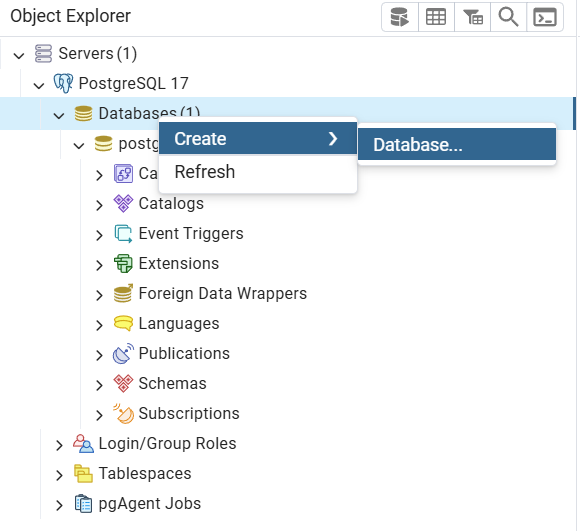
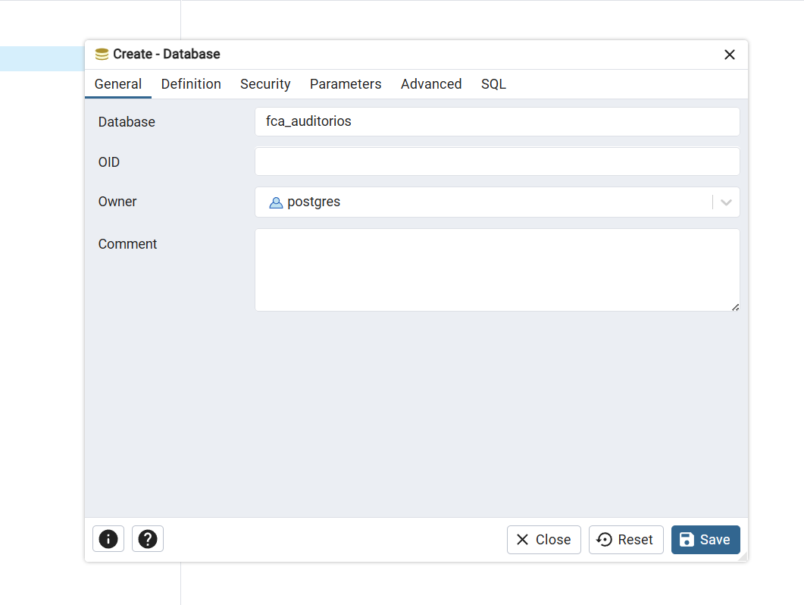
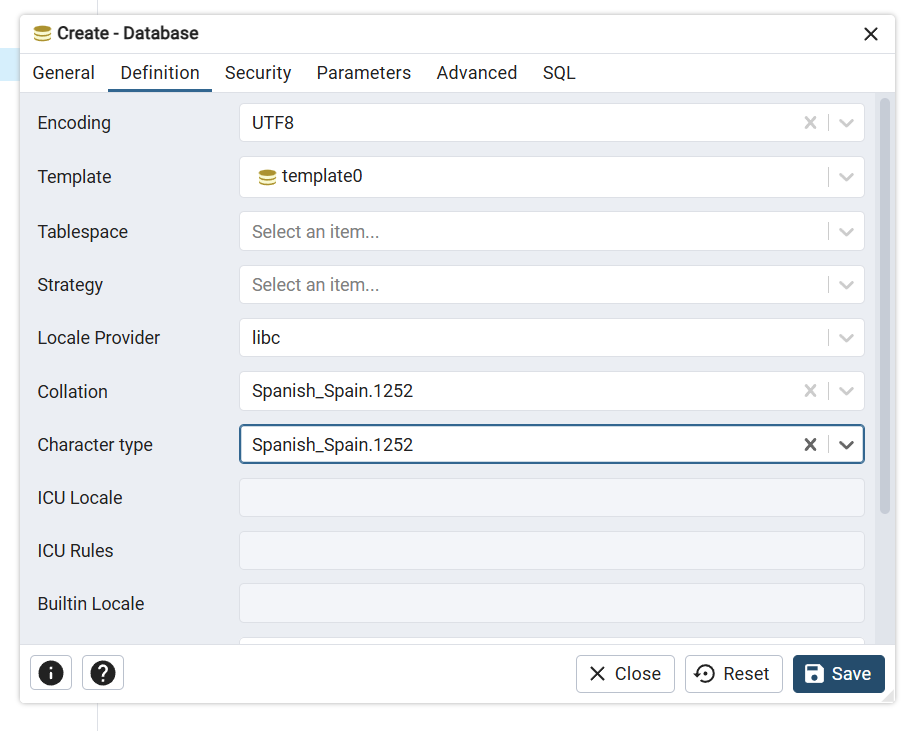

<p align="center">
  
</p>

# Manual técnico
## 1. Información general
|  |  |
| --- | --- |
| Proyecto | `FCA Auditorios` |
| Equipo | `idk` |
| Fecha | `11-14-2025` |

## 2. Descripción General del Sistema
### Resumen técnico
`FCA Auditorios` es una aplicación web diseñada para la gestión de los recintos (auditorios) de la facultad FCA UNAM y los eventos ceremoniales, acádemicos, culturales,etc. que se realizan en los mismos.

**Objetivo**: Facilitar la gestión de reservación de recintos de la facultad que seran usados para realizar eventos.

### Alcance
El sistema esta diseñado para atender 3 roles de usuario y cada rol tienes sus propias funcionalidades.

#### SUPERADMINISTRADOR
- Gestionar usuarios
- Gestionar calendario escolar
- Consultar registros de auditoria

#### ADMINISTRADOR
- Autorizar/Cancelar eventos de los funcionarios
- Generar reportes de eventos
- Consultar el calendario de eventos
- Gestionar inventarios
- Gestionar recintos
- Gestionar usuarios con rol funcionario
- Descargar semblanzas y reconocimientos
  - Estos archivos se generan automaticamente

#### FUNCIONARIO
- Gestionar sus propios eventos

### Arquitectura General
El sistema es una **aplicación web monolítica** donde:

* El **frontend** se sirve desde el mismo despliegue que el backend.
* El **backend** expone controladores (controllers) que implementan la lógica de negocio y gestionan las peticiones HTTP.
* El backend se conecta directamente a una **base de datos única** para leer y escribir datos.

### Componentes
1. **Usuario**
   * Interactúa con el sistema a través de un navegador u otra interfaz cliente.

2. **Frontend (Vista)**
   * Renderiza la interfaz de usuario.
   * Envía peticiones HTTP/JSON al backend (controllers).
   * Muestra los datos recibidos desde el backend.

3. **Backend (Controllers / Lógica de negocio)**
   * Expone endpoints (REST).
   * Valida y procesa las peticiones del frontend.
   * Coordina la lógica de negocio.
   * Ejecuta consultas a la base de datos (lectura/escritura).

4. **Base de datos**
   * Almacena la información persistente del sistema.
   * Es accedida únicamente por el backend dentro del monolito.

### Flujo básico de una petición

1. El **usuario** realiza una acción en el frontend (clic, envío de formulario, etc.).
2. El **frontend** envía una petición al **backend (controller)**.
3. El **controller** procesa la petición, aplica reglas de negocio y consulta/actualiza la **base de datos**.
4. El **backend** devuelve la respuesta al **frontend**.
5. El **frontend** actualiza la interfaz para el **usuario**.

### Diagrama de arquitectura


## 3. Tecnologías Utilizadas

### Frontend
El sistema aprovecha: El tipado de `Typescript`, para trazar errores mas facilmente. La agilidad que otorga usar los estilos y componentes de `TailwindCSS` y  `Shadcdn/ui`.

- React + Vite (Typescript)
- TailwindCSS
- Shadcdn/ui

### Backend
El sistema aprovecha: La seguridad y rapidez para crear endpoints de `Springboot` + `JPA` y `SrpingSecurity` + `JWT`. La agilidad para ejecutar las migraciones con `Flyway DB`.

- Springboot (Java)
- SpringSecurity
- JWT
- JPA
- Flyway DB

### Database
El sistema aprovecha la fiabilidad y robustes del SMBDR `PostgreSQL` junto con la comodidad de su shell `PSQL`.

- PostgreSQL

---

## 4. Base de datos
La base de datos esta estructurada segun el paradigma relacional. 

### Modelo conceptual
Este diagrama describe la esencia de las entendidades presentes en la gestión de recintos. Donde los usuarios gestionan la lógistica de los recintos al ser usados en los eventos academicos de la facultad, es por ello que vemos a los ponentes que participan en ellos, al calendario escolar que los rige y a los recintos en los que se realizan. 


### Modelo físico
Este diagrama describe la implementacion de la base datos: inlcluye catalogos, tablas transitorias y una nueva relación: auditoria, la cual sirve para trazar la actividad en el sistema. 


### Diccionario de datos
`<Diccionario de datos>`

### Scripts de base de datos
El proyecto cuenta con un directorio `/database`, este directorio contiene todos los scripts relacionados con la base de datos. Los scripts que inician con el prefijo `00-`, esta orientados a ayudar en el desarrollo, los demas sirven para construirla.

> **Importante**
El sistema no necesita que se ejecuten los scripts con prefijo `0#-`, ya que estos se ejecutan con `Flyway DB` en el directorio `backend\src\main\resources\db`. Su ejecución manual puede llevar a errores si el sistema esta en ejecución.

#### Script de Construcción
El script `02_crear_tablas.sql` construye las tablas en el esquema `public` de la base de datos.

```psql
psql -U postgres -d fca_auditorios -f 02_crear_tablas.sql
```

#### Script de Datos de Prueba
El script `05_cargar_datos_de_prueba.sql` construye las tablas en el esquema `public` de la base de datos.

```psql
psql -U postgres -d fca_auditorios -f 05_cargar_datos_de_prueba.sql
```

## 6. Instalación y despliegue

### Requisitos
- NodeJS
- npm
- npx
- PostgreSQL
- PSQL
- JAVA 17
- Git (para descargar el proyecto)

### Instalación Local
#### 1. Clonar el proyecto del repositorio
```git
git clone https://github.com/TacticalOnion/idk-fca-auditorios.git
```

#### 2. Cargar variables de entorno
Antes de cargar las variables de entorno debes modificar el `.env.example` con tus valores y renombrarlo a `.env`. 

##### Backend
Ejecuta el siguiente script en el directorio `/backend` para cargar las variables de ambiente del backend. 
```shell
.\load-env.ps1
```

> **Importante**: necesitas tener permiso de ejecución de scripts
> ```
> Set-ExecutionPolicy RemoteSigned -Scope CurrentUser
> ```

Si no puedes ejectuar `load-env.ps1` la otra opción es declararlos directamente.

```powershell
set SPRING_DATASOURCE_URL=jdbc:postgresql://localhost:5432/fca_auditorios
set SPRING_DATASOURCE_USERNAME=postgres
set SPRING_DATASOURCE_PASSWORD=changeme

set SPRING_SECURITY_USER_NAME=admin
set SPRING_SECURITY_USER_PASSWORD=changme
set SPRING_SECURITY_USER_ROLES=ADMIN

set JWT_SECRET=<hash>
```

> **Importante**: esta forma no ha sido probada


##### Frontend
El frontend solo tiene una variable de entorno. La cual debe ser cargada desde la terminal:

Cargar variable para visualizar imagenes. El ejemplo muestra el valor para ejecución en local.
```powershell
SET VITE_API_URL=http://localhost:8080
```

#### 3. Construir base de datos
Para crear la base de datos, existen dos opciones:

##### Terminal
---
1. Ejecuta el siguiente sctipt desde la raiz del proyecto.

```sql
psql -U postgres -f database/01_crear_base_de_datos.sql
```

> **Notas**
> * Cambia el usuario postgres al nombre de usuario de tu preferencia
> * Si no vas a usar el usuario `postgres` recuerda modificar el archivo `.env`
> * Despues de ejecutar la instrucción deberas ingresar la contraseña del usuario que uses

##### PgAdmin
---
1. Al iniciar sesión en PgAdmin e ingresar al server (con tu contraseña de usuario). Deberás hacer `click derecho` en `Databases` y seleccionar `Create>Database...`



2. Ingresar en el campo `Database` el nombre de la base de datos `fca_auditorios`



3. Configurar la base de datos con los siguientes datos y hacer click en `Save`.

    * `Encoding : UTF8`
    * `Locale Provider : libc`
    * `Collation : Spanish_Spain.1252`
    * `Character type : Spanish_Spain.1252`



#### 4. Inicializar servicios
1. Abre 3 terminales y renombralas como: `backend`,`frontend`,`database`. Tal como se muestra en la imagen:


 En la terminal `backend` accede al directorio `/backend` y ejecuta lo siguiente:
```powershell
./mvnw spring-boot:run
```

3. En la terminal `frontend` accede al directorio `/frontend` y ejecuta los siguiente:
```powershell
npm install
npm run dev
```

4. Accede a `http://localhost:5173/` para acceder al proyecto

5. 

#### Nota importante
Debido aque el sistema se encuentra en cosntante mejora, voy a estar actualizando la documentación presente en el README y los archivos de la carpeta `doc/` del repositorio.
